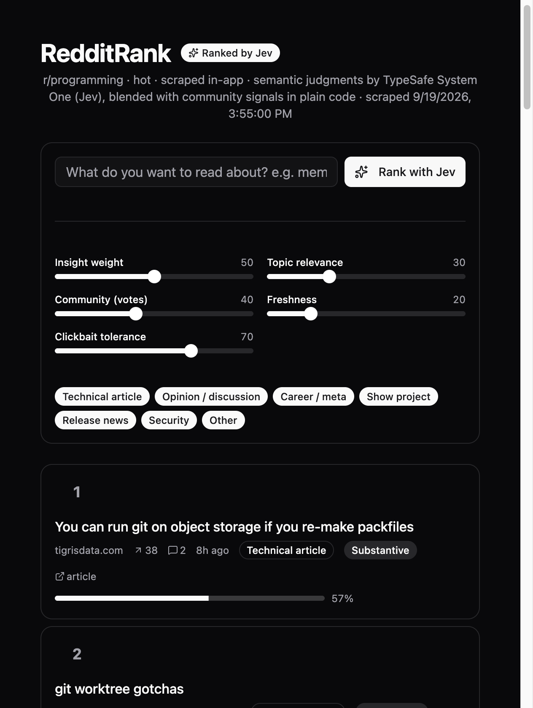

# RedditRank

AI-ranked digest of [r/programming](https://www.reddit.com/r/programming/). Posts are scraped from Reddit, judged by **TypeSafe's Jev** (a System One model that returns typed answers and probabilities instead of text), and blended with community signals in plain code — so you can re-rank the front page by substance, not just upvotes.



## Why it's interesting

Raw Reddit ranking rewards whatever is already popular. RedditRank asks a different question: *which posts are actually worth a programmer's time?* Jev scores every post on semantic dimensions a vote count can't capture:

- **Insight** — a graded score from *shallow* to *insightful*, based on technical depth and practical value
- **Clickbait** — a probability that the title is sensationalized ragebait
- **Category** — technical article, release news, opinion, security, show project, career/meta
- **Topic relevance** — graded relevance to whatever you're trying to read about (optional query)

Code then owns the ranking: a weighted composite of insight, relevance, community votes, and freshness. Dragging a slider re-ranks instantly — **the judgments are computed once and reused; changing weights never re-runs inference.**

## Features

- Type a topic (e.g. "compilers and programming languages") and watch the front page re-rank by relevance
- Five live sliders: insight weight, topic relevance, community votes, freshness, clickbait tolerance
- Category filter chips and per-post badges (insight grade, category, clickbait %)
- Dark mode by default
- **Static-friendly build**: `npm run build` bakes the latest scrape + cached Jev judgments into the bundle, so the deployed demo shows real AI rankings with no backend and no exposed keys

## How it works

```
Reddit (RSS or in-app scrape)
        │
        ▼
┌─────────────────┐     ┌──────────────────────────┐
│  server/api.mjs │────▶│  TypeSafe Jev (jev-latest)│  ← key stays server-side
│  (dev middleware)│     │  insight / clickbait /    │
└─────────────────┘     │  category / relevance     │
        │               └──────────────────────────┘
        ▼                            │
  posts + judgments ◀────────────────┘
        │
        ▼
  Composite scoring in the client (weights you control)
        │
        ▼
  Ranked, filterable post list
```

Jev judgments are cached per post, and per (topic, post) for relevance — the same post is never judged twice.

## Tech stack

React 18 · TypeScript · Vite 7 · Tailwind CSS 3 + shadcn/ui · TypeSafe System One (Jev)

## Getting started

```bash
npm install

# optional, for live Jev scoring — get a key at https://typesafe.ai
cp server/.env.example server/.env   # then add your TYPESAFE_API_KEY

npm run dev        # http://localhost:3000 — frontend + API in one process
```

Without a key the app runs in heuristic mode (keyword fallbacks). With a key it auto-scores on load and the "Rank with Jev" button re-scores against your topic query.

Other commands:

```bash
npm run bake       # copy latest scrape + judgments into public/data/
npm run build      # production build (bakes data first via prebuild)
npm run preview    # serve the production build locally
```

## Deployment

**Static (GitHub Pages, Netlify drop, any static host)** — `npm run build` and publish `dist/`. The demo renders real Jev rankings from build-time cached judgments. Note: topic-relevance queries need the live backend, so the static demo re-uses cached judgments and falls back gracefully.

**Live scoring (Vercel, Netlify Functions, etc.)** — the dev API in `server/api.mjs` needs to be adapted to a serverless function (store `TYPESAFE_API_KEY` as an env var, never in the client). The frontend talks to `/api/posts`, `/api/health`, and `POST /api/score { query }`.

## Notes

- Reddit data is fetched from the public RSS feed / web page for personal, non-commercial use, per Reddit's terms. Refresh the scrape before demos.
- This repository intentionally contains **no API keys**. `server/.env` is git-ignored; only `server/.env.example` ships.
